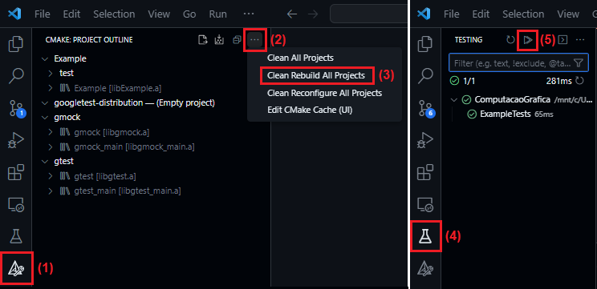
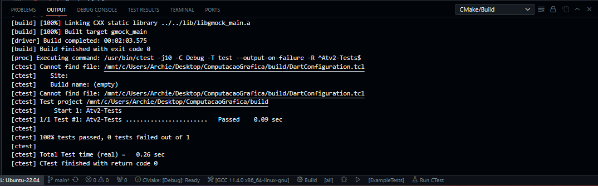

# Atividade 02 - 9 de Outubro

<!-- ## Tutorial "Ray Tracing in One Weekend" -->

Nesta segunda atividade, foram seguidos os passos da Seção 3 de _"Ray Tracing in One Weekend"_. Estes passos recriam o programa em _`C++`_ e geram a mesma imagem _`.ppm`_ da _[Atividade 00](https://github.com/Arth-Felipe/ComputacaoGrafica/tree/main/Atividade%2000%20-%2002.10)_, mas dessa vez utilizando-se de dois novos arquivos:

1. _`vec3.h`_ - Definição de uma classe para trabalhar com um vetor geométrico de tamanho 3, bem como seu conjunto de funções e operações.
2. _`color.h`_ - Usa a nova classe _`vec3.h`_ para definir uma função que grava a cor de um único pixel no fluxo de saída padrão.

Para tanto, o arquivo _`main.cc`_ passou a ter em seu cabeçalho a inclusão de ambos, mas sem alterar muito a sua compilação e devida transformação do arquivo de execução em imagem, como pode ser conferido a seguir:

```
g++ -Wall -o executavel main.cc
./executavel > image.ppm
```

Ao abrir o arquivo de saída gerado num visualizador de _`ppm`_ online _([acesso aqui](https://www.cs.rhodes.edu/welshc/COMP141_F16/ppmReader.html))_, obteve-se o mesmo resultado da _[Atividade 00](https://github.com/Arth-Felipe/ComputacaoGrafica/tree/main/Atividade%2000%20-%2002.10)_:


## Atividade Proposta

Agora sim, seguindo a proposta da ___Atividade 02___, foram criadas classes próprias para a manipulação de vetores e matrizes de diversos tamanhos, expandidos para:

- _`vec2.h`_ - Classe responsável por lidar com vetores de tamanho 2.
- _`vec4.h`_ - Classe responsável por lidar com vetores de tamanho 4.
- _`mat2.h`_ - Classe responsável por manipular matrizes de tamanho 2x2.
- _`mat3.h`_ - Classe responsável por tratar de operações com matrizes de tamanho 3x3.
- _`mat4.h`_ - Classe responsável por operar com matrizes de tamanho 4x4.

Tais classes incluem diversas operações de manipulação de vetores e matrizes, tais como adição, subtração, multiplicação por escalar, de matriz por matriz, de matriz por vetor, produto escalar, produto vetorial, negação, impressão, matriz de identidade, transposição, determinante, inversão, entre outras funcionalidades úteis.

## Testes Unitários

Para a criação e uso de testes unitários, foi escolhida a biblioteca do Google Test. Para iniciar o seu uso, primeiramente foram instaladas as seguintes extensões no Visual Studio Code:
- C/C++, da Microsoft
- CMake Tools, da vector-of-bool

Visto que estamos usando o WSL no Visual Studio Code, também intalamos o CMake pelo terminal através do comando:

```
sudo apt install cmake
```

Na pasta pai das atividades, "ComputacaoGrafica", foi feito um clone do repositório Google Test com o comando:

```
git clone https://github.com/google/googletest.git
```

Para definir o projeto, na pasta pai "ComputacaoGrafica" foi criado um arquivo denominado `CMakeLists.txt`, um diretório chamado `test` e, dentro deste, foram criados os arquivos `CMakeLists.txt` e `ExampleTests.cc`, este último com a definição dos testes em si. Para rodar os testes, o próprio Visual Studio Code fornece um caminho através de sua interface, que podem ser conferidos na imagem abaixo:



Por fim, os resultados podem ser conferidos abrindo o terminal e indo na aba "Output". Abaixo uma comprovação de que todos foram bem-sucedidos:



Para a realização correta de todos esses procedimentos e devida correção dos erros que surgiram, foram utilizados os seguintes materiais de apoio:

- [Introduction to Google Test and CMake, por Rhymu's Videos](https://www.youtube.com/watch?v=Lp1ifh9TuFI)
- [GoogleTest | GoogleTest Primer](https://google.github.io/googletest/primer.html)
- [GoogleTest | Assertions Reference](https://google.github.io/googletest/reference/assertions.html)
