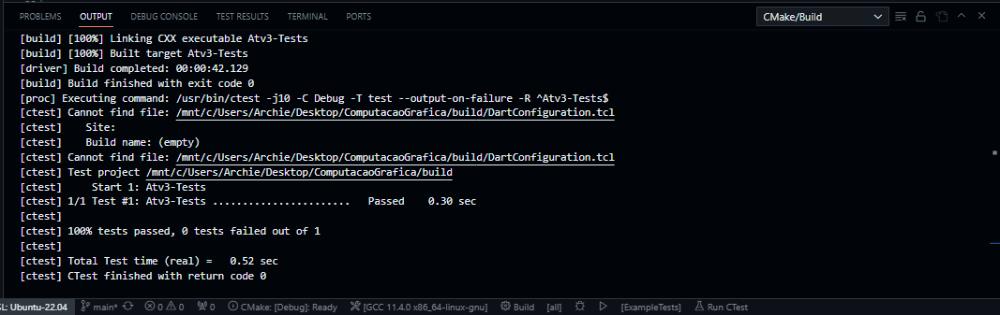

# Atividade 03 - 16 de Outubro

Nesta terceira atividade o objetivo era estudar o formato de arquivos `.obj` _("Object")_ e criar uma classe própria para a leitura de seus modelos. Para tanto, foi criado o arquivo `processObject.h`, responsável por definir a classe que realiza a leitura de arquivos Object.

Para os testes unitários, foi baixado o arquivo `example-sword.obj` do site fornecido _(https://free3d.com/)._ Encima dele foram escritos testes capazes de testar se seu carregamento e abertura eram possíveis, bem como se vértices, coordenadas de textura, normais e faces eram lidos e identificados corretamente. O passo a passo para a preparação do ambiente de testes foi descrito na atividade anterior, a _[Atividade 2](https://github.com/Arth-Felipe/ComputacaoGrafica/tree/main/Atividade%2002%20-%2009.10)_, e o resultado de sua execução pode ser conferido na imagem abaixo:

