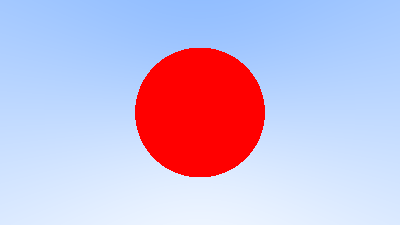
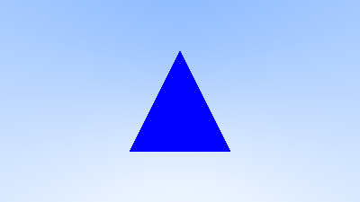
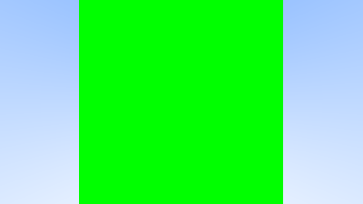

# Atividade 04 - 30 de Outubro

## Objetivo
Nesta quarta atividade foram seguidos os passos da 5ª Seção do tutorial _["Ray Tracing in One Weekend"](https://raytracing.github.io/books/RayTracingInOneWeekend.html)_ e da Seção 6.2 do tutorial _["Ray Tracing: The Next Week"](https://raytracing.github.io/books/RayTracingTheNextWeek.html)._ Seus objetivos eram:
- Implementação de uma imagem _raytraced_ de uma esfera vermelha, integrando com as implementações anteriores das _[Atividades 1](https://github.com/Arth-Felipe/ComputacaoGrafica/tree/main/Atividade%2001%20-%2002.10)_ e _[2](https://github.com/Arth-Felipe/ComputacaoGrafica/tree/main/Atividade%2002%20-%2009.10)_.
- Implementação de uma imagem _raytraced_ de um triângulo.
- Visualização de um objeto lido de um arquivo OBJ, usufruindo das implementações da _[Atividade 3](https://github.com/Arth-Felipe/ComputacaoGrafica/tree/main/Atividade%2003%20-%2016.10)_.

## Modificações
- `MakeImage.cc` e `MakeImage.h` - Novo método de salvamento de arquivos, com passagem do nome desejado por parâmtero. Sobrescrita do construtor para ser capaz de receber novos tamanhos de imagem como parâmetro. Mudança da extensão do arquivo a ser passado como parâmetro na conversão de _`.ppm`_ para _`.png`_.
- `processObject.h` - Adaptação da _struct Vertex_ para ser capaz de converter objetos _vertex_ em pontos do tipo _`point3`_.

## Novos Programas
- `ray.h` - Programa proposto pelo tutorial, com a intenção de representar um raio, com posição, ponto de origem e direção.
- `main.cc` - Programa usado para criar uma cena virtual, definir parâmetros da câmera e da imagem, e usar ray tracing para determinar as cores dos pixels na imagem final. Possui a definição das classes _`hit_sphere`, `hit_triangle`, `hit_obj`, `ray_color`_ e _`renderScene`_.

## Execução
- `Makefile` - arquivo de centralização dos comandos de compilação e execução. Agora a compilação pode ser feita apenas com o comando _`make`_ e a execução com _`./executavel`_. Com o comando _`make clean`_ é possível ainda limpar todo o "lixo" gerado pela compilação, excluindo assim o arquivo _`executavel`_ e todos com terminações _`.o`_, _`.png`_ e _`.ppm`_.

## Resultados
- `obj.ppm`, `sphere.ppm`, `triangle.ppm` - Primeiros arquivos de imagem gerados.
- `obj.png`, `sphere.png`, `triangle.png` - Arquivos de resultado da conversão de imagens tipo _`.ppm`_.
- `cube.obj` - Arquivo OBJ baixado do site fornecido (_https://free3d.com/_).

