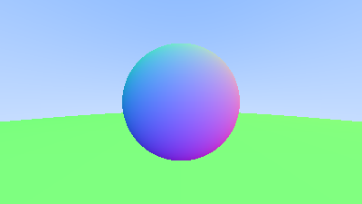
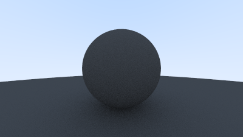
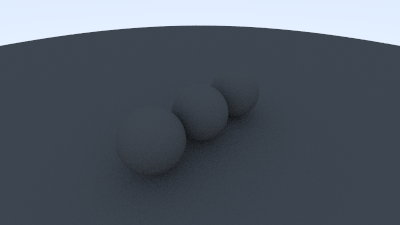
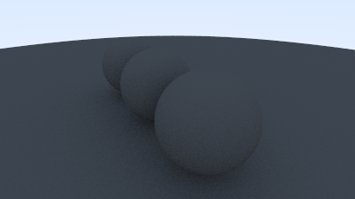

# Atividade 05 - 18 de Dezembro

## Objetivo
Através dos ensinamentos obtidos com a leitura das seções 6, 7, 8, 9 e 12 do tutorial _["Ray Tracing in One Weekend"](https://raytracing.github.io/books/RayTracingInOneWeekend.html)_, usar um arquivo com informação de normal para implementar o material difuso e, por fim, visualizar uma cena com pelo menos três objetos e de dois pontos de vista diferentes.

## Modificações
- `color.h` - Atualização da função `write_color()` para se obter a soma total de toda a luz do pixel e também contabilizar o número de amostras envolvidas.
- `vec3.h` - Atualmente não temos uma maneira de refletir aleatoriamente um raio, então precisaremos adicionar algumas funções à manipulação de vetores, como a capacidade de gerar vetores aleatórios arbitrários, um método de rejeição para gerar o vetor aleatório dentro da esfera unitária, a normalização desse vetor e a determinação de qual hemisfério ele se encontra através do produto escalar.

## Novos Programas
- `hittable.h` - Classe abstrata para qualquer coisa que um raio possa atingir. Possui uma função `hit` responsável por determinar se um raio atinge o objeto e, se sim, fornecer informações sobre o ponto de interseção.
- `sphere.h` - Implementação específica da interface descrita acima (ou seja, ao herdar da classe `hittable.h`, ela garante que qualquer objeto da classe `sphere` possa ser tratado polimorficamente como um objeto `hittable`). Portanto, essa classe também teve que implementar a função `hit`, fornecendo uma lógica específica para determinar se um raio atinge uma esfera e calcular as informações de interseção necessárias.
- `hittable_list.h` - Classe que armazena uma lista de `hittables`.
- `rtweekend.h` - Arquivo de cabeçalho geral com constantes matemáticas úteis (como infinito e pi) e funções utilitárias para o futuro. Também é capaz de gerar e retornar números aleatórios reais.
- `interval.h` - Classe de intervalo para gerenciar intervalos de valores reais com mínimo e máximo, usada com bastante frequência mais a frente.
- `camera.h` - Mudança do código da câmera da `main` para uma classe própria. Responsável por (1) construir e enviar raios para o mundo e (2) usar os resultados desses raios para construir a imagem renderizada. Depois que a `main` cria uma câmera e define seus valores padrão, ela chama o método `render()`, que prepara a câmera e então executa o loop de renderização.

## Arquivos OBJ Externos
- `dodgeball.obj`
- `cube.obj`

## Execução
- `Makefile` - arquivo de centralização dos comandos de compilação e execução. Agora a compilação pode ser feita apenas com o comando _`make`_ e a execução com _`./executavel`_. Com o comando _`make clean`_ é possível ainda limpar todo o "lixo" gerado pela compilação, excluindo assim o arquivo _`executavel`_ e todos com terminações _`.o`_, _`.png`_ e _`.ppm`_.

## Resultados

