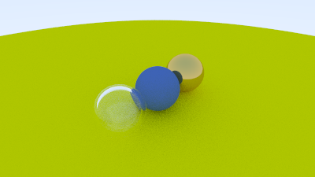
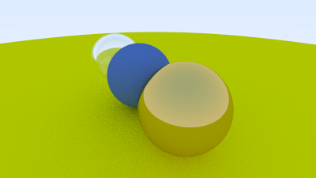

# Atividade 06 - 19 de Dezembro

## Objetivo
Através dos ensinamentos obtidos com a leitura das seções 10 e 11 do tutorial _["Ray Tracing in One Weekend"](https://raytracing.github.io/books/RayTracingInOneWeekend.html)_, implementar materiais com reflexão e refração e, por fim, visualizar uma cena com um objeto metálico e outro de vidro.

## Modificações
- `hittable.h` - Modificada para incluir um ponteiro para o material do objeto atingido.
- `sphere.h` - Quando um raio atinge uma esfera específica, o ponteiro do material em `hit_record` será definido para apontar para o ponteiro do material que a esfera recebeu quando foi configurada em `main()`. Para conseguir isso, `hit_record` precisa saber o material que está atribuído à esfera.
- `vec3.h` - Adicionada a função `reflect` para calcular a reflexão de um vetor.
- `camera.h` - Modificação feita em todas as funções `ray_color()`
- `main.cc` - Agora o programa principal cria uma cena com diferentes materiais (lambertiano e metal) e configura as câmeras. A imagem resultante mostrava a renderização da cena com metal brilhante e esferas de metal difusas, após a implementação da seção 10. Contudo, na seção 11, as esferas na cena foram atualizadas para utilizar o material dielétrico, representando vidro. Um truque interessante foi usar um raio negativo para invertar a normal, criando assim uma esfera oca. Isso é utilizado na cena para criar uma esfera de vidro oca.

## Novos Programas
- `material.h` - Classe abstrata que aplica diferentes materiais a diferentes objetos. Possui uma função `scatter`, usada para calcular o raio espalhado e a atenuação quando um raio atinge uma superfície. Introduz a classe `lambertian` para representar materiais lambertianos (difusos) e que também implementa a função `scatter`, que calcula um raio disperso aleatório e define a atenuação. A função `scatter` de `metal` usa a função `reflect` para calcular o raio refletido. A classe de material `metal` é estendida para incluir um parâmetro de imprecisão, permitindo reflexões difusas. A função `scatter` agora adiciona uma perturbação ao raio refletido com base na imprecisão. Materiais claros como água, vidro e diamante são dielétricos. Ao atingi-los, um raio de luz se divide em um raio refletido e um raio refratado. A classe `dielectric` é introduzida para representar materiais esses dielétricos. Nela, o índice de refração é utilizado para determinar se o raio deve ser refratado ou refletido.

## Execução
- `Makefile` - arquivo de centralização dos comandos de compilação e execução. Com ele, a compilação pode ser feita usando apenas o comando _`make`_ e a execução com _`./executavel`_. Com o comando _`make clean`_ é possível ainda limpar todo o "lixo" gerado pela compilação, excluindo assim o arquivo _`executavel`_ e todos com terminações _`.o`_, _`.png`_ e _`.ppm`_.

## Resultados

